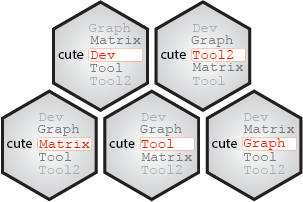

# cuteMatrix <a href="">[](https://yushihn.github.io/cuteMatrix)</a>

<br />

<!-- badges: start -->

[](https://github.com/yushiHn/cuteMatrix/actions)

[](https://app.codecov.io/github/yushiHn/cuteMatrix?branch=master)
[](https://cran.r-project.org/package=cuteMatrix)
[](https://www.rdocumentation.org/trends)
[](https://opensource.org/licenses/MITgpl-3-0)
[](https://github.com/yushiHn/cuteMatrix/actions/workflows/rworkflows.yml)
<!-- badges: end -->

<br />

## Table of content

   - [Description](#description)
   - [Content](#content)
   - [Versions](#versions)
   - [Installation](#installation)
   - [Licence](#licence)
   - [Citations](#citations)
   - [Credits](#credits)
   - [Acknowledgements](#acknowledgements)

<br />

## Description

Set of R functions for the development of R functions, written according to the [cute_project](https://github.com/gael-millot/cute_project) specifications.

<br />

## Content

| Function | Description |
| --- | --- |
| **mat_fill()** | Detect the empty half part of a symmetric square matrix (either topleft, topright, bottomleft or bottomright). Fill this empty half part using the other symmetric half part of the matrix. |
| **mat_inv()** | Return the inverse of a square matrix when solve() cannot. |
| **mat_num2color()** | Convert a matrix made of numbers into a hexadecimal matrix for rgb colorization. |
| **mat_op()** | Assemble several matrices of same dimensions by performing by case operation. For instance, with kind.of.operation = "+", the function will add the value of all the case 1 (row1 & column1) of the matrices and put it in the case 1 of a new matrix M, according to the formula $$c_{ij} = \sum_{k=1}^{k=z} c_{ijk}$$ where c: case, i: row number, j: column number, k: matrix number and z: number of matrices |
| **mat_rotate()** | 90° clockwise matrix rotation. Applied twice, the function provide the mirror matrix, according to vertical and horizontal symmetry. |

<br />

Read `vignette("cuteMatrix")` for more details.

<br />

## Versions

The different *cuteMatrix* releases are tagged [here](https://github.com/yushiHn/cuteMatrix/tags).

<br />

## Installation

*cuteMatrix* can be currently be installed from GitHub:

```r
install.packages("remotes")
remotes::install_github("https://github.com/yushiHn/cuteMatrix")
```

Older versions can be installed like this:

```r
v <- "v1.0" # desired tag version
remotes::install_github(paste0("https://github.com/yushiHn/cuteMatrix/tree/", v))
```

<br />

## Licence

This package can be redistributed and/or modified under the terms of the GNU General Public License as published by the Free Software Foundation, either version 3 of the License, or (at your option) any later version.
Distributed in the hope that it will be useful, but without any warranty; without even the implied warranty of merchandability or fitness for a particular purpose.
See the GNU General Public License for more details at https://www.gnu.org/licenses.

<br />

## Citation

If you are using functions of *cuteMatrix*, please cite: 

> Han Y, Serizay J, Millot GA (2023). _The R cuteMatrix package_.
> <https://github.com/yushiHn/cuteMatrix/>.

<br />

## Credits

[Yushi Han](https://github.com/yushiHn/), Bioinformatics and Biostatistics Hub, Institut Pasteur, Paris, France

[Jacques Serizai](https://github.com/js2264), Spatial Regulation of Genomes team, Institut Pasteur, Paris, France

[Gael A. Millot](https://gitlab.pasteur.fr/gmillot), Bioinformatics and Biostatistics Hub, Institut Pasteur, Paris, France

<br />

## Acknowledgements

The developers & maintainers of [R](https://www.r-project.org/) as well as packages used in the *cuteMatrix* functions.

